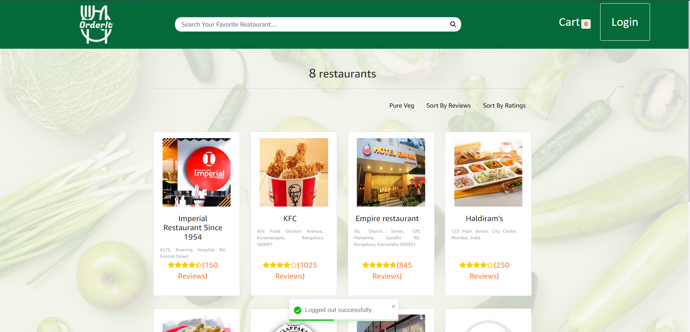
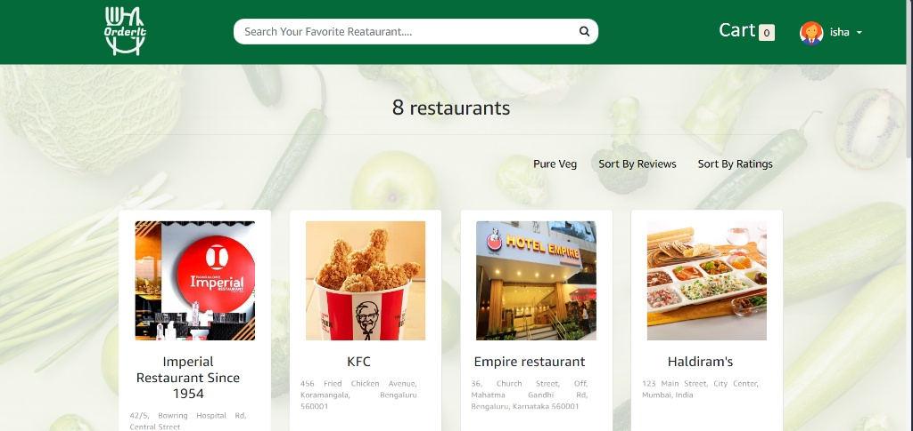
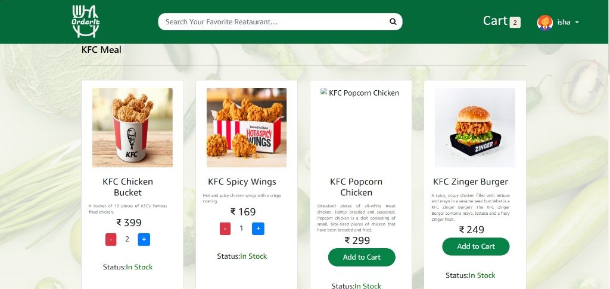
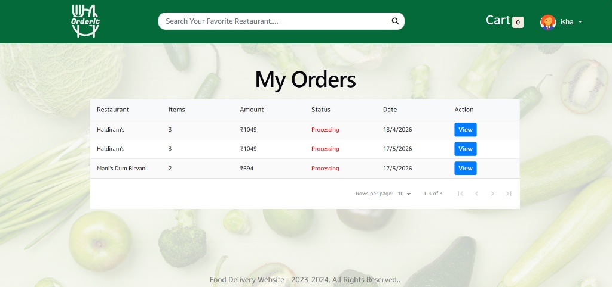
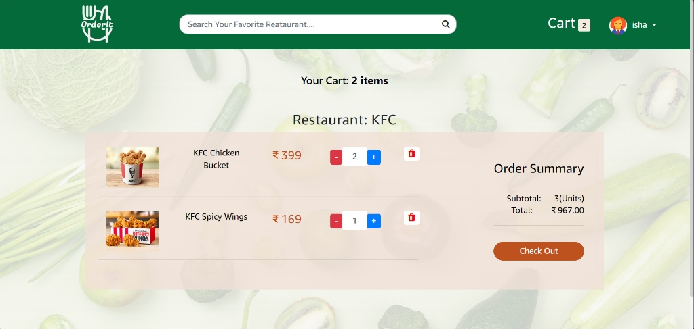
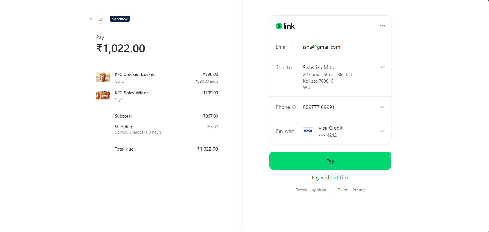
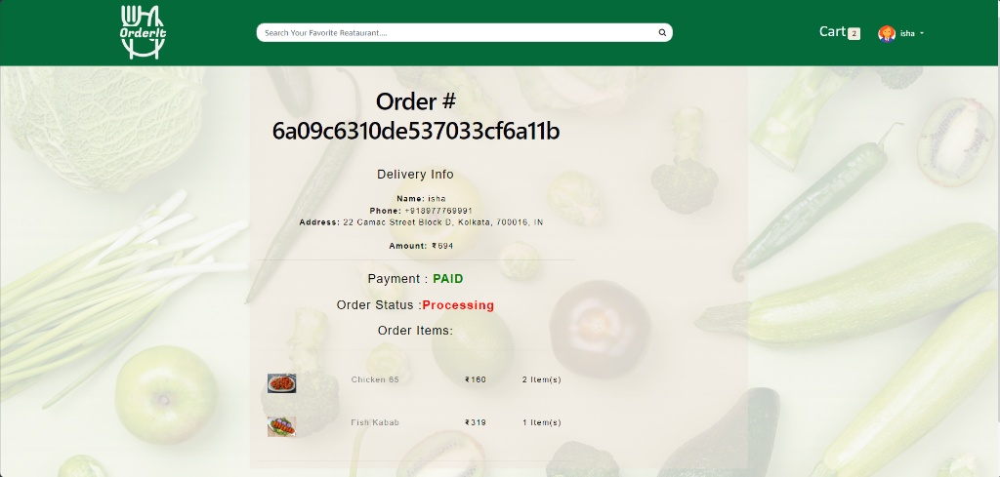
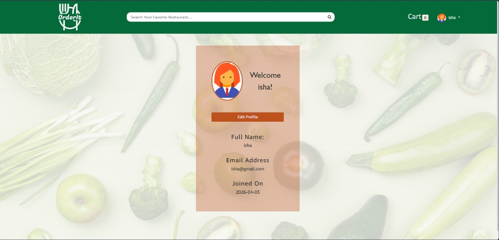
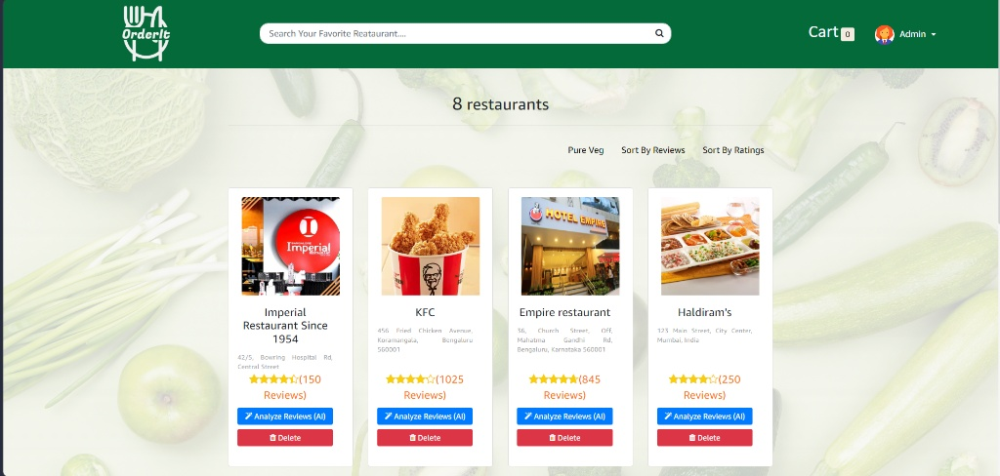

# OrderIt - Full Stack Food Ordering & Delivery System

OrderIt is a responsive, feature-rich full-stack web application built using the MERN stack (MongoDB, Express.js, React, Node.js). The application offers a seamless food ordering experience for customers, complete with secure checkout through Stripe integration, user profile management, and an advanced AI-powered Admin panel for restaurant management and customer sentiment analysis.

## 🚀 Live Screenshots & Application Flow

### 1. Home Page 
The landing page displays active restaurants with options to filter by dietary preferences (Pure Veg) or sort by ratings and customer reviews.
 

### 2. User Page & Restaurant Discovery
The landing page displays active restaurants with options to filter by dietary preferences (Pure Veg) or sort by ratings and customer reviews.
 

### 3. Menu Explorer & Real-Time Cart Updates
Users can browse individual restaurant menus, view descriptions, check real-time stock availability, and update items dynamically using interactive quantity adjusters.


### 4. Order Management & Tracking
The dedicated dashboard keeps track of historical and current orders, including transaction values, specific timestamps, and execution statuses.


### 5. Interactive Shopping Cart
Review staged menu items, unit prices, subtotal tallies, and progress seamlessly to the delivery details collection form.


### 6. Secure Stripe Sandbox Checkout Flow
Integrated with Stripe Checkout to provide encrypted, secure processing for Visa, Mastercard, and digital wallet payment options.


### 7. Dynamic Order Invoice Summary
Upon a successful transaction hook, a unique order hash is generated alongside explicit receipt data and delivery dispatch updates.


### 8. Core Profile Management
Authenticated users can access their central account portal, track registration timelines, and dynamically update contact configurations.


### 9. Admin Control Center & AI Review Analyzer
The high-level administrative interface allows complete CRUD control over restaurant entries alongside a custom **Analyze Reviews (AI)** mechanism powered by Google Gemini to break down user sentiments.


---

## ✨ Core Features

### 👤 Customer Facing
* **Dynamic Menu & Cart System:** Add/remove items with instant state-driven total updates.
* **Granular Filtering & Sorting:** Fast sorting based on client review data, star metrics, or pure-vegetarian status flags.
* **Robust Authentication:** Secure registration, user login sessions, and structured profile mutation screens.
* **Historical Order Logs:** View persistent lists of active or historic culinary checkouts.

### 🛡️ Administrative Portal
* **Restaurant Inventory CRUD:** Instantly create, update, or remove restaurant listings from the live database cluster.
* **Google Gemini Integration:** Built-in AI module capable of reading extensive customer review arrays and returning parsed sentiment analysis reports.
* **Order Status Tracking:** Move order execution pipelines from `Processing` to active logistics stages.

---

## 🛠️ Tech Stack & Architecture

### Frontend (Client-side)
* **Framework:** React.js (Scaffolded with Vite for optimal HMR performance)
* **State Management:** Redux Toolkit / React-Redux for global UI, cart context, and user authentication state syncing.
* **Styling Frameworks:** Bootstrap 4, Font Awesome 4.7, and Google Material Symbols for clean components.

### Backend (Server-side)
* **Runtime Environment:** Node.js
* **Framework:** Express.js
* **Database Engine:** MongoDB (Object Document Mapping handled via Mongoose)
* **Payment Processing:** Stripe Node SDK
* **Media Asset Delivery:** Cloudinary integration for scalable multi-restaurant menu image hosting.
* **Template Engine:** Pug (for transactional mailing/internal render views)

---

## 📂 Repository Structure

```text
FOODORDERPROJECT/
├── Backend/
│   ├── config/             # Cloudinary configuration and environment definitions
│   ├── controllers/        # Express handlers (Auth, Cart, Food, AI engines)
│   ├── middlewares/        # Async error wrappers and JWT RBAC checks
│   ├── models/             # Strict Mongoose Document Schemas (User, Order, Menu)
│   ├── routes/             # Clean REST Endpoint routing definitions
│   ├── services/           # AI core execution scripts and sentiment parsers
│   └── server.js           # Network entry point
└── frontend/
    ├── public/             # Static browser assets (Favicon, baseline vectors)
    ├── src/
    │   ├── Components/     # Modular Layout elements, User Portals, Cart views
    │   ├── redux/          # Redux Action dispatchers and Slice definitions
    │   ├── utils/          # Axios wrappers and API configuration layers
    │   ├── App.jsx         # Component router tree setup
    │   └── main.jsx        # App mounting configuration